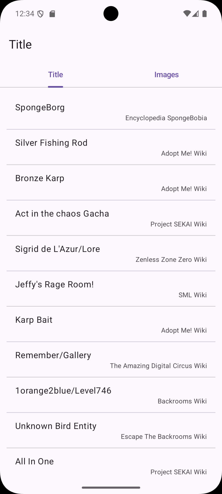
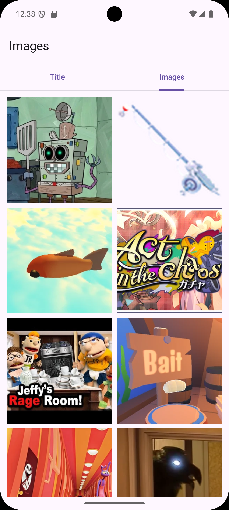

# Fandom Recruitment Task

This project is a recruitment task for **Fandom**, built using **Kotlin Multiplatform** and **Compose Multiplatform**,
targeting both **Android** and **iOS** from a shared codebase.

## About the App

The app consumes a public API and displays trending articles data across two tabs:

- **Titles** — a scrollable list of titles, each showing the title name and its associated community (wiki) name.
- **Images** — a two-column grid of images.

The project follows **Clean Architecture** principles, separated into `data`, `domain`, and `presentation` layers per
feature, with a `core` module for shared infrastructure (networking, dependency injection, configuration, and
utilities).

## Tech Stack

- Kotlin Multiplatform
- Compose Multiplatform
- Ktor (networking — OkHttp engine on Android, Darwin engine on iOS)
- kotlinx.serialization (JSON parsing)
- Coil 3 (image loading)
- AndroidX ViewModel + StateFlow (state management)

## Screenshots

| Titles                                         | Images                                         |
|------------------------------------------------|------------------------------------------------|
|  |  |

